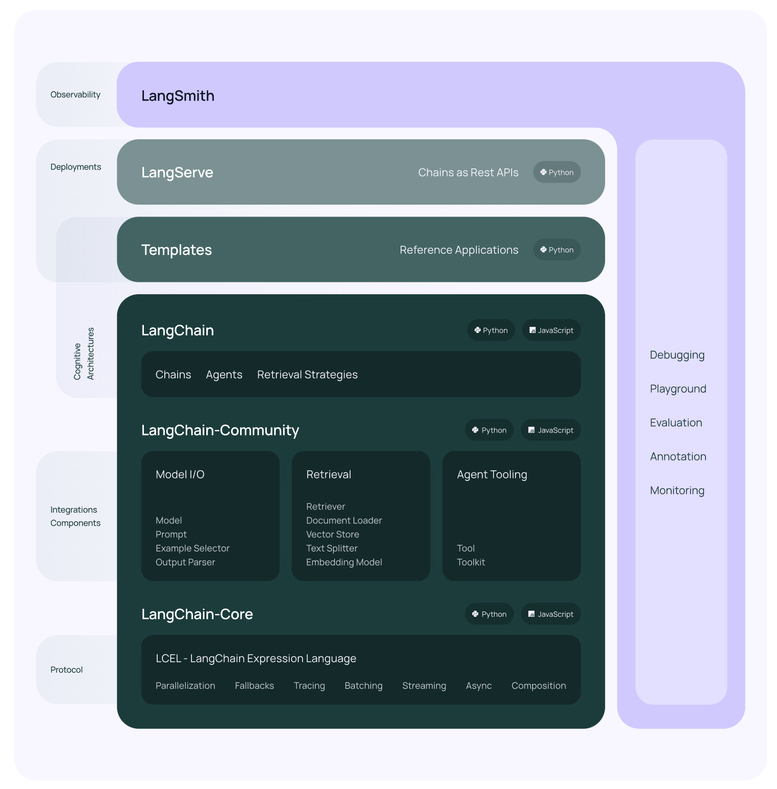

= LangChain

== Introduction
https://python.langchain.com/docs/get_started/introduction/[LangChain] is a framework for developing applications powered by large language models (LLMs).

== Libraries
* `langchain-core` Base abstractions and LangChain Expression Language
* `langchain-community` Third party integrations, like langchain-openai
* `langchain` Chains, agents, and retrieval strategies that make up an application's cognitive architecture.
* `langgraph` Build robust and stateful multi-actor applications with LLMs by modeling steps as edges and nodes in a graph.
* `langserve` Deploy LangChain chains as REST APIs.
* `LangSmith` A developer platform that lets you debug, test, evaluate, and monitor LLM applications and seamlessly integrates with LangChain. For `observability`

== Achitecture

== LangChain Expression Language (LCEL)
`LangChain Expression Language (LCEL)` is the foundation of many of LangChain's components, and is a declarative way to compose chains.

== Chain vs. Agent
* Chain
  ** Chains represent a sequence of actions that are *hardcoded* in the code. Essentially, they define a predefined flow of conversation.
  ** When using chains, developers explicitly specify the steps or responses that the system should follow.
  ** However, they lack the flexibility to adapt dynamically based on user input or context changes.

* Agent
  ** Agents, on the other hand, leverage a language model as a reasoning engine to determine which actions to take and in what order.
  ** Instead of fixed sequences, agents use the language model to *dynamically* choose actions based on context, user input, and other relevant factors.
  ** Agents select and use `Tools` and `Toolkits` for actions.

== Building with LangChain
=== Chains
==== LLM Chain
just relies on information in the prompt template to respond

[source,python]
.Initialize the LLM
----
from langchain_openai import ChatOpenAI

llm = ChatOpenAI(api_key="...")
llm.invoke("how can langsmith help with testing?")
----

[source,python]
.Define Chain with `Prompt Template` and `Output Parser`
----
from langchain_core.prompts import ChatPromptTemplate

prompt = ChatPromptTemplate.from_messages([
    ("system", "You are world class technical documentation writer."),
    ("user", "{input}")
])

from langchain_core.output_parsers import StrOutputParser
output_parser = StrOutputParser()

# compose the LLM Chain
chain = prompt | llm | output_parser

chain.invoke({"input": "how can langsmith help with testing?"})
----

==== Retrieval Chain
we need to provide additional context to the LLM. We can do this via `retrieval`. Retrieval is useful when you have too much data to pass to the LLM directly. You can then use a retriever to fetch only the most relevant pieces and pass those in.

[source,python]
.embedding model
----
from langchain_core.prompts import ChatPromptTemplate

embeddings = OpenAIEmbeddings()
----

[source,python]
.vector store
----
from langchain_community.vectorstores import FAISS
from langchain_text_splitters import RecursiveCharacterTextSplitter

text_splitter = RecursiveCharacterTextSplitter()
documents = text_splitter.split_documents(docs)
vector = FAISS.from_documents(documents, embeddings)

from langchain.chains.combine_documents import create_stuff_documents_chain

prompt = ChatPromptTemplate.from_template("""Answer the following question based only on the provided context:

<context>
{context}
</context>

Question: {input}""")

document_chain = create_stuff_documents_chain(llm, prompt)

from langchain_core.documents import Document

document_chain.invoke({
    "input": "how can langsmith help with testing?",
    "context": [Document(page_content="langsmith can let you visualize test results")]
})

from langchain.chains import create_retrieval_chain

retriever = vector.as_retriever()
retrieval_chain = create_retrieval_chain(retriever, document_chain)

response = retrieval_chain.invoke({"input": "how can langsmith help with testing?"})
print(response["answer"])
----

==== Conversation Retrieval Chain
LLM Chain and Retrieval Chain can only answer single question. One of the main types of LLM applications that people are building are chat bots.

=== Agents
Chains, where each step is known ahead of time. Agents, where the LLM decides what steps to take.

== Retrieval Augmented Generation (RAG)
Typical `RAG` app has two main components:

* `Indexing`: ingesting data from a source and indexing it, usually happens offline.

* `Retrieval and generation`: the RAG chain, takes the user query at run time and retrieves the relevant data from the index, then passes that to the model.

=== Indexing
. `Load`: load the data with `DocumentLoaders`.
. `Split`: `Text splitters` break large Documents into smaller chunks.
. `Store`: Store and index the splits with `VectorStore` and `Embeddings`

image::indexing.png[]

=== Retrieval and generation
. `Retrieve`: Given a user input, relevant splits are retrieved from storage using a `Retriever`
. `Generate`: A ChatModel / LLM produces an answer using a prompt that includes the question and the retrieved data

image::rag.png[]

== LangChain Expression Language (LCEL)
LangChain Expression Language, or LCEL, is a declarative way to easily compose chains together. The chain works like a pipeline.

image::pipeline.png[]

=== Runnable interface
Many LangChain components implement the `Runnable` protocol, including chat models, LLMs, output parsers, retrievers, prompt templates.

The standard interface includes:

* `invoke`: call the chain on an input
* `stream`: stream back chunks of the response
* `batch`: call the chain on a list of inputs

also include corresponding async methods:

* `ainvoke`: call the chain on an input async
* `astream`: stream back chunks of the response async
* `abatch`: call the chain on a list of inputs async
* `astream_log`: stream back intermediate steps as they happen, in addition to the final response
* `astream_events`: beta stream events as they happen in the chain (introduced in langchain-core 0.1.14)

The `input type` and `output type` by components:

|===
|Component |Input Type |Output Type

|Prompt
|Dictionary
|PromptValue

|ChatModel
|Single string, list of chat messages or a PromptValue
|ChatMessage

|LLM
|Single string, list of chat messages or a PromptValue
|String

|OutputParser
|The output of an LLM or ChatModel
|Depends on the parser

|Retriever
|Single string
|List of Documents

|Tool
|Single string or dictionary, depending on the tool
|Depends on the tool
|===

=== RunnableSequence, sequentially chaining runnables
This can be done using the pipe operator (`|`), or the more explicit `pipe()` method. The resulting `RunnableSequence` is itself a runnable, which means it can be invoked, streamed, or piped just like any other runnable.

[source,python]
.Chaining example
----
composed_chain_with_lambda = (
    chain                               # start from a chain
    | (lambda input: {"joke": input})   # Convert to RunnableLambda
    | analysis_prompt
    | model
    | StrOutputParser()
)
----

=== RunnableParallel, parallel chaining runnables
The `RunnableParallel` primitive is essentially a dict whose values are runnables (or things that can be coerced to runnables, like functions). It runs all of its values in parallel, and each value is called with the overall input of the RunnableParallel. The final return value is a dict with the results of each value under its appropriate key.

[source,python]
.Parallel runnable example
----
retrieval_chain = (
# a dict is a RunnableParallel, its return is also a dict
    {"context": retriever, "question": RunnablePassthrough()}
    | prompt
    | model
    | StrOutputParser()
)
----

----
RunnableParallel(context=retriever, question=RunnablePassthrough())
----

=== RunnablePassthrough
Pass through the input as output. +
`RunnablePassthrough.assign()`, in addition to the passthrough value, add a new key with value from a (lambda) function

[source,python]
.RunnablePassthrough.assign()
----
from langchain_core.runnables import RunnableParallel, RunnablePassthrough

runnable = RunnableParallel(
    passed=RunnablePassthrough(),
    extra=RunnablePassthrough.assign(mult=lambda x: x["num"] * 3),
    modified=lambda x: x["num"] + 1,
)

runnable.invoke({"num": 1})

"""
return is {'passed': {'num': 1}, 'extra': {'num': 1, 'mult': 3}, 'modified': 2}
"""
----

=== Using itemgetter as shorthand
you can use Python’s `itemgetter` as shorthand to extract data from the map when combining with `RunnableParallel`

[source,python]
.itemgetter example
----
from operator import itemgetter

from langchain_community.vectorstores import FAISS
from langchain_core.output_parsers import StrOutputParser
from langchain_core.prompts import ChatPromptTemplate
from langchain_core.runnables import RunnablePassthrough
from langchain_openai import ChatOpenAI, OpenAIEmbeddings

vectorstore = FAISS.from_texts(
    ["harrison worked at kensho"], embedding=OpenAIEmbeddings()
)
retriever = vectorstore.as_retriever()

template = """Answer the question based only on the following context:
{context}

Question: {question}

Answer in the following language: {language}
"""
prompt = ChatPromptTemplate.from_template(template)

chain = (
    {
        "context": itemgetter("question") | retriever,
        "question": itemgetter("question"),
        "language": itemgetter("language"),
    }
    | prompt
    | model
    | StrOutputParser()
)

chain.invoke({"question": "where did harrison work", "language": "italian"})
----

=== Parallelize steps
RunnableParallel (aka. RunnableMap) makes it easy to execute multiple Runnables in parallel, and to return the output of these Runnables as a map.
[source,python]
.Parallelization example
----
from langchain_core.prompts import ChatPromptTemplate
from langchain_core.runnables import RunnableParallel
from langchain_openai import ChatOpenAI

model = ChatOpenAI()
joke_chain = ChatPromptTemplate.from_template("tell me a joke about {topic}") | model
poem_chain = (
    ChatPromptTemplate.from_template("write a 2-line poem about {topic}") | model
)

map_chain = RunnableParallel(joke=joke_chain, poem=poem_chain)

map_chain.invoke({"topic": "bear"})
----

[source,python]
.result returns in a dict
----
{'joke': AIMessage(content="Why don't bears wear shoes?\n\nBecause they have bear feet!"),
 'poem': AIMessage(content="In the wild's embrace, bear roams free,\nStrength and grace, a majestic decree.")}
----

== Model I/O
Formatting and managing language model input and output

* Prompts
* Chat models
* LLMs
* Output parsers

=== Prompts
A prompt for a language model is a set of instructions or input provided by a user to guide the model's response, helping it understand the context and generate relevant and coherent language-based output

* few-shot examples prompts
* example selectors
* partial prompts
* compose prompts together

== Retrieval
Interface with application-specific data for e.g. RAG

* Document loaders
* Text splitters
* Embedding models
* vectorstores
* Retrievers

== Composition
Higher-level components that combine other arbitrary systems and LangChain primitives together

* Tools
* Agents
* Chains

== Additional

* Memory
* Callbacks
