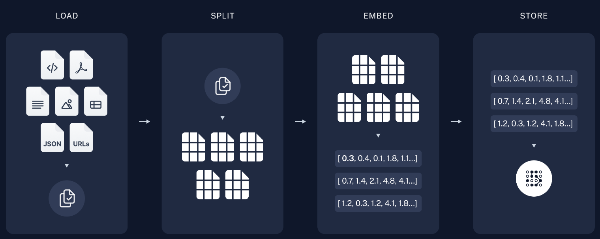
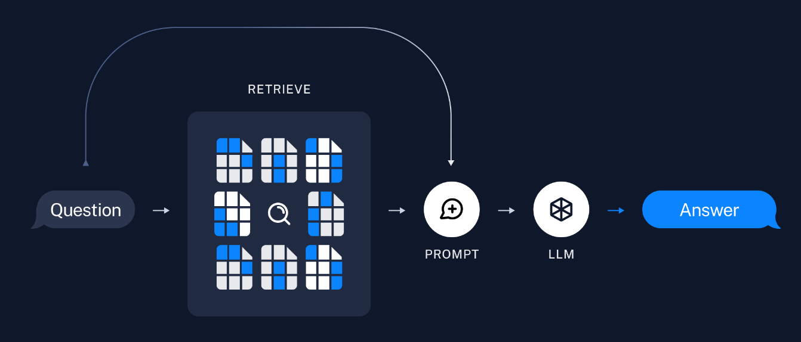
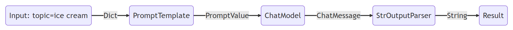

= LangChain

== Introduction
https://python.langchain.com/docs/get_started/introduction/[LangChain] is a framework for developing applications powered by large language models (LLMs).

== Libraries
* `langchain-core` Base abstractions and LangChain Expression Language
* `langchain-community` Third party integrations, like langchain-openai
* `langchain` Chains, agents, and retrieval strategies that make up an application's cognitive architecture.
* `langgraph` Build robust and stateful multi-actor applications with LLMs by modeling steps as edges and nodes in a graph.
* `langserve` Deploy LangChain chains as REST APIs.
* `LangSmith` A developer platform that lets you debug, test, evaluate, and monitor LLM applications and seamlessly integrates with LangChain. For `observability`

== Achitecture
image::architecture.png[]

== LangChain Expression Language (LCEL)
`LangChain Expression Language (LCEL)` is the foundation of many of LangChain's components, and is a declarative way to compose chains.

== Chain vs. Agent
* Chain
  ** Chains represent a sequence of actions that are *hardcoded* in the code. Essentially, they define a predefined flow of conversation.
  ** When using chains, developers explicitly specify the steps or responses that the system should follow.
  ** However, they lack the flexibility to adapt dynamically based on user input or context changes.

* Agent
  ** Agents, on the other hand, leverage a language model as a reasoning engine to determine which actions to take and in what order.
  ** Instead of fixed sequences, agents use the language model to *dynamically* choose actions based on context, user input, and other relevant factors.

== Building with LangChain
=== Chains
==== LLM Chain
just relies on information in the prompt template to respond

[source,python]
.Initialize the LLM
----
from langchain_openai import ChatOpenAI

llm = ChatOpenAI(api_key="...")
llm.invoke("how can langsmith help with testing?")
----

[source,python]
.Define Chain with `Prompt Template` and `Output Parser`
----
from langchain_core.prompts import ChatPromptTemplate

prompt = ChatPromptTemplate.from_messages([
    ("system", "You are world class technical documentation writer."),
    ("user", "{input}")
])

from langchain_core.output_parsers import StrOutputParser
output_parser = StrOutputParser()

# compose the LLM Chain
chain = prompt | llm | output_parser

chain.invoke({"input": "how can langsmith help with testing?"})
----

==== Retrieval Chain
we need to provide additional context to the LLM. We can do this via `retrieval`. Retrieval is useful when you have too much data to pass to the LLM directly. You can then use a retriever to fetch only the most relevant pieces and pass those in.

[source,python]
.embedding model
----
from langchain_core.prompts import ChatPromptTemplate

embeddings = OpenAIEmbeddings()
----

[source,python]
.vector store
----
from langchain_community.vectorstores import FAISS
from langchain_text_splitters import RecursiveCharacterTextSplitter

text_splitter = RecursiveCharacterTextSplitter()
documents = text_splitter.split_documents(docs)
vector = FAISS.from_documents(documents, embeddings)

from langchain.chains.combine_documents import create_stuff_documents_chain

prompt = ChatPromptTemplate.from_template("""Answer the following question based only on the provided context:

<context>
{context}
</context>

Question: {input}""")

document_chain = create_stuff_documents_chain(llm, prompt)

from langchain_core.documents import Document

document_chain.invoke({
    "input": "how can langsmith help with testing?",
    "context": [Document(page_content="langsmith can let you visualize test results")]
})

from langchain.chains import create_retrieval_chain

retriever = vector.as_retriever()
retrieval_chain = create_retrieval_chain(retriever, document_chain)

response = retrieval_chain.invoke({"input": "how can langsmith help with testing?"})
print(response["answer"])
----

==== Conversation Retrieval Chain
LLM Chain and Retrieval Chain can only answer single question. One of the main types of LLM applications that people are building are chat bots.

=== Agents
Chains, where each step is known ahead of time. Agents, where the LLM decides what steps to take.

== Retrieval Augmented Generation (RAG)
Typical `RAG` app has two main components:

* `Indexing`: ingesting data from a source and indexing it, usually happens offline.

* `Retrieval and generation`: the RAG chain, takes the user query at run time and retrieves the relevant data from the index, then passes that to the model.

=== Indexing
. `Load`: load the data with `DocumentLoaders`.
. `Split`: `Text splitters` break large Documents into smaller chunks.
. `Store`: Store and index the splits with `VectorStore` and `Embeddings`

=== Retrieval and generation
. `Retrieve`: Given a user input, relevant splits are retrieved from storage using a `Retriever`
. `Generate`: A ChatModel / LLM produces an answer using a prompt that includes the question and the retrieved data

== LangChain Expression Language (LCEL)
LangChain Expression Language, or LCEL, is a declarative way to easily compose chains together. The chain works like a pipeline.

=== Runnable interface
Many LangChain components implement the `Runnable` protocol, including chat models, LLMs, output parsers, retrievers, prompt templates.

The standard interface includes:

* `invoke`: call the chain on an input
* `stream`: stream back chunks of the response
* `batch`: call the chain on a list of inputs

also include corresponding async methods:

* `ainvoke`: call the chain on an input async
* `astream`: stream back chunks of the response async
* `abatch`: call the chain on a list of inputs async
* `astream_log`: stream back intermediate steps as they happen, in addition to the final response
* `astream_events`: beta stream events as they happen in the chain (introduced in langchain-core 0.1.14)

The `input type` and `output type` by components:

|===
|Component |Input Type |Output Type

|Prompt
|Dictionary
|PromptValue

|ChatModel
|Single string, list of chat messages or a PromptValue
|ChatMessage

|LLM
|Single string, list of chat messages or a PromptValue
|String

|OutputParser
|The output of an LLM or ChatModel
|Depends on the parser

|Retriever
|Single string
|List of Documents

|Tool
|Single string or dictionary, depending on the tool
|Depends on the tool
|===

