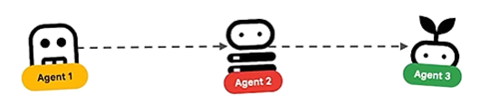
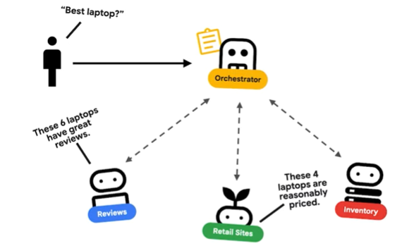
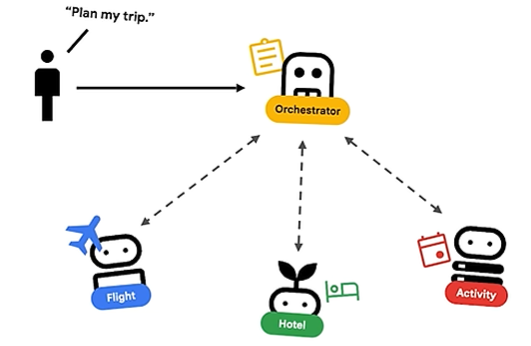
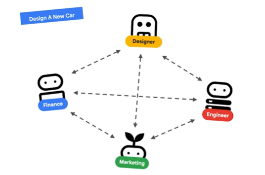
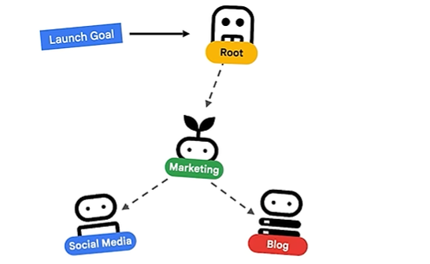

= Agent

== Multi-agent patterns
* sequential pattern

Sequential agent pattern is an AI assembly line, where the output of one agent becomes the input for the next agent in the chain. 

* parallel pattern

Parallel agent architecture is set up for speed and efficiency. With this pattern, have your agent do multiple things at once. 

* multi-agent coordinator pattern

A multi-agent coordinator pattern uses a central agent that breaks down complex problems and delegates tasks to specialized sub-agents. 

* swarm pattern

The swarm pattern is the most creative and collaborative agent pattern, with a group of specialized agents that can all talk to each other.

* review and critique pattern

The review and critique pattern consists of a generator agent and a critic agent. Use the review and critique AI architecture for tasks where accuracy and safety are crucial. 

* hierarchical task pattern

The hierarchical task decomposition pattern breaks down complex and massive, open-ended problems into simpler, manageable subtasks. 

* human-in-the-loop pattern

The human-in-the-loop (HITL) architecture builds in a human oversight checkpoint right into the AI workflow so that a person can review or approve the decision before it can continue. 

