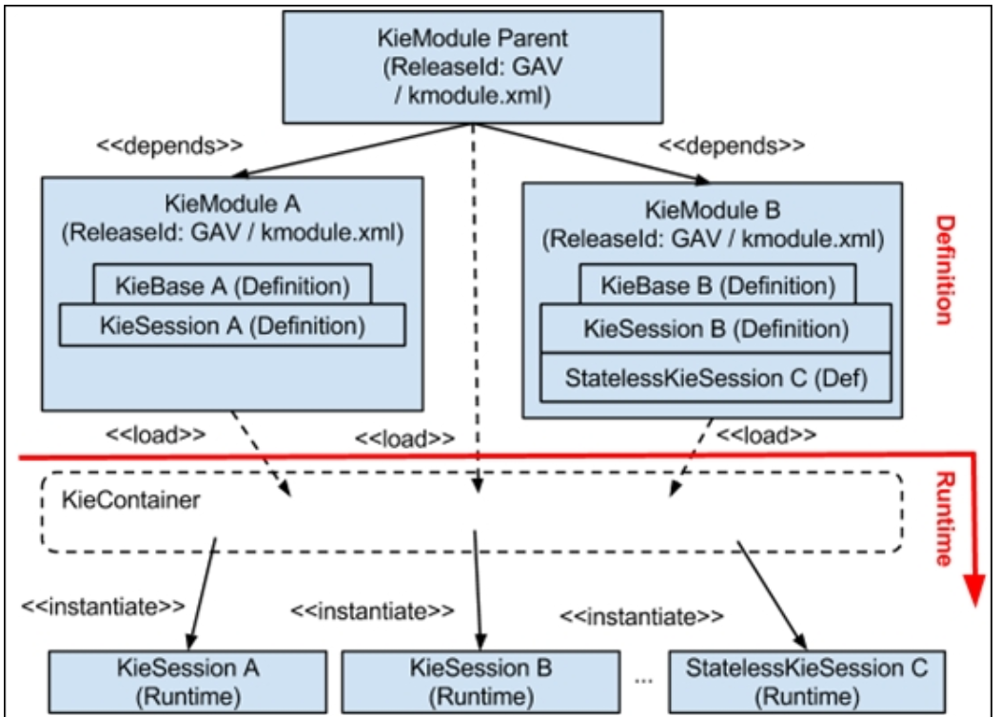
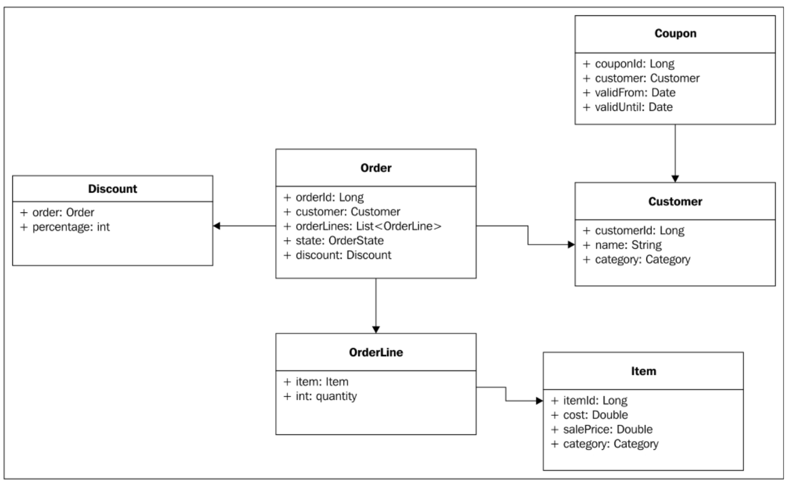

= Drools

== What is KIE
KIE - Knowledge is Everything

== Principles for Business Rule writing

* Independence
* Atomicity

== KIE Classes & Methods
.KIE Components

* KieServices

* KieContainer
** newKieSession(), create a stateful KIE session
** newStatelessKieSession(), create a stateless KIE session

* KieModule
** defined by kmodule.xml in META-INF/ directory; containing a set of rules

* KieBase

* KieScanner
** The KieScanner component in Drools is nothing but a wrapper around a KieContainer that can be configured to automatically detect changes in the resources that the container depends on.

* KieSession
** fireAllRules()
** insert()
** delete()
** update()
** modify()

[source,java]
.modify domain objects by modify() or update()
----
modify($c){setCategory(Customer.Category.GOLD);}

// above code is equivalent to

$c.setCategory(Customer.Category.GOLD);
update($c);
----

.Bootstrap and get KieContainer by Classpath resolution strategy
[source,java]
----
KieServices ks = KieServices.Factory.get();
KieContainer kContainer = ks.newKieClasspathContainer();
// KieSession name is defined in kmodule.xml
KieSession kieSession = kContainer.newKieSession("rules.cp.discount.session");
----

.Bootstrasp and get KieContainer by Maven dependency resolution techniques
[source,java]
----
KieServices ks = KieServices.Factory.get();
KieContainer kContainer = ks.newKieContainer(ks.newReleaseId("groupID", "artifactId", "version"));
// KieSession name is defined in kmodule.xml
KieSession kieSession = kContainer.newKieSession("rules.cp.discount.session");
----

== How to create Drool project

* Create `kmodule.xml` in `resources/META-INF/`
** `name` property of the kbase tag is the same as the directory structure that we are using under the /src/main/resources/ directory, where the rules are stored.
** `includes` property of the kbase tag is making reference to other KieBases defined in other modules

[source,xml]
----
<?xml version="1.0" encoding="UTF-8"?>
<kmodule xmlns:xsi="http://www.w3.org/2001/XMLSchema-instance"
         xmlns="http://jboss.org/kie/6.0.0/kmodule">
     <kbase name="discount" default="true" includes="rules.premium, rules.simple">
        <ksession name="rules.simple.discount" type="stateful"/>
        <ksession name="rules.simple.sl.discount" type="stateless"/>
    </kbase>
</kmodule>
----

* Define rules in `.drl` file

TIP: drl, Drool Rule Language

** Package definition, same as in Java
** Imports section, import classes used in the rule
** (Optional) Declared types and events
** Rules

[source,java]
----
package myfirstproject.rules;
import org.drools.devguide.eshop.model.Item;
import org.drools.devguide.eshop.model.Item.Category;
rule "Classify Item - Low Range"
    when
        $i: Item(cost < 200)
    then
        $i.setCategory(Category.LOW_RANGE);
end
----

* Start rule engine
[source,java]
----
public class App {
  public static void main( String[] args ) {
    System.out.println( "Bootstrapping the Rule Engine ..." );
    //1) Bootstrapping a Rule Engine Session
    KieServices ks = KieServices.Factory.get();
    KieContainer kContainer = ks.getKieClasspathContainer();
    KieSession kSession =  kContainer.newKieSession();

    Item item = new Item("A", 123.0,234.0);
    System.out.println( "Item Category: " + item.getCategory());
    //2) Provide information to the Rule Engine Context
    kSession.insert(item);
    //3) Execute the rules that are matching
    int fired = kSession.fireAllRules();
    System.out.println( "Number of Rules executed = " + fired );
    System.out.println( "Item Category: " + item.getCategory());
  }
}
----

=== drl file examples
[source,java]
.example, set rule condition by object filter with criteria
----
package myfirstproject.rules;
import org.drools.devguide.eshop.model.Item;
import org.drools.devguide.eshop.model.Item.Category;
rule "Classify Item - Low Range"
    when
        $i: Item(cost < 200)
    then
        $i.setCategory(Category.LOW_RANGE);
end
----

[source,java]
.example, this and modify()
----
/*
 * Use this to self-reference
 * modify() to modify domain object in KieSession
 * modify() could trigger rule that expect Silver Customers
 */

rule "Classify Customer by order size"
    when
        $o: Order( orderLines.size >= 5, $customer: customer )
        $c: Customer(this == $customer, category == Customer.Category.NA)
    then
        ;
        modify($c){
       	setCategory(Customer.Category.SILVER)
        };
end
----

[source,java]
.example, insert()
----
/*
 * insert() to create new domain object in KieSession,
 * which could trigger other rule that is expecting Couples.
 */

rule "Create Coupons for Silver Customers"
    when
        $o: Order( $customer: customer )
        $c: Customer(this == $customer, category == Category.SILVER)
    then
        insert(new Coupon($c, $o, Coupon.CouponType.POINTS));
end
----

.Order Class Diagram

[source,java]
.example, access list member, forall condition
----
/*
 * forall, which makes sure that all OrderLines and the associated items of the order are categorized as HIGH_RANGE items.
 * If there is at least one item with a different category set associated with the current order, this rule will not get activated and fired.
 */
rule "High Range Order - 10% Discount"
    when
        $o: Order( $lines : orderLines.size >= 2, discount == null )
        forall( OrderLine( this memberOf $lines,  $item : item)
                Item(this == $item, category == Item.Category.HIGH_RANGE)
        )
    then

modify($o){
setDiscount(new Discount(10.0))
};
end
----

[source,java]
.Global variables  defined in the DRL code
----
global EShopConfigService configService;
----

== Rule attributes

Drools rules are data-driven. This means that the only way to activate a rule is by adding data to the engine's working memory that matches the conditions of that rule.

[source,java]
.empty `when` make the rule execute unconditionally
----
rule "rule execute unconditionally"
   when
   then System.out.println("execute unconditionally");
end
----

[source,java]
.`enabled` attribute to disable rule execution
----
rule "disable execution by setting enabled to false"
enabled false
   when Customer()
   then System.out.println("we have a customer");
end
----

[source,java]
.`salience` set priority of the rule. Rule has default 0 salience. It can set to negative or positive value.
----
rule "Classify Item - Mid/High Range (special)"
salience 10
   when
      $i: Item( cost > 300 && cost < 400 )
   then
      $i.setCategory(Item.Category.SPECIAL_MIDHIGH_RANGE);
      update($i);
end
----

[source,java]
.`no-loop` to avoid infinite loop. When a rule update a domain object, every rule get reevaluated and the rule itself can be trigger multiple times and cause infinite loop. `no-loop` help in such case.
----
rule "Classify Item - Mid/High Range (special)"
no-loop
salience 10
   when
      $i: Item( cost > 300 && cost < 400 )then
      $i.setCategory(Item.Category.SPECIAL_MIDHIGH_RANGE);
      update($i);
end
----

[source,java]
.attributes are evaluate after condition of a rule, which means that they can use the data from the condition to decide the boolean value of the enabled attribute. Below example set `salience` and `enabled` dynamically
----
global EShopConfigService configService;
...
rule "Classify Item - Mid/High Range (special)"
no-loop
salience ($i.getCost())
enabled(configService.isMidHighCategoryEnabled())
   when
      $i: Item( cost > 300 && cost < 400 )
   then
      $i.setCategory(Item.Category.SPECIAL_MIDHIGH_RANGE);
      update($i);
end
----

